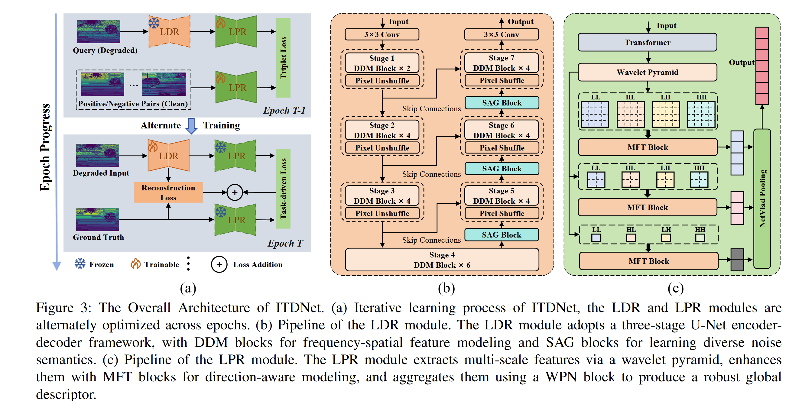

### [An Iterative Task-Driven Framework for Resilient LiDAR Place Recognition in Adverse Weather](https://example.com/article-link)

<p>
  <a href="https://scholar.google.com.sg/citations?hl=zh-CN&user=miv8T6MAAAAJ&view_op=list_works&sortby=pubdate">Xiongwei Zhao</a><sup>1</sup>,
  <a href="https://scholar.google.com.sg/citations?user=DvrngV4AAAAJ&hl=zh-CN">Xieyuanli Chen</a><sup>2</sup>,
  <a href="https://scholar.google.com.sg/citations?user=VWjvfjkAAAAJ&hl=zh-CN&oi=sra">Xu Zhu</a><sup>1</sup>,
   Xingxiang Xie<sup>3</sup>,
   Haojie Bai<sup>1</sup>,
  <a href="https://scholar.google.com.sg/citations?user=OTBgvCYAAAAJ&hl=zh-CN&oi=ao">Congcong Wen</a><sup>4</sup>,
  Rundong Zhou<sup>5</sup>,
  Qihao Sun<sup>1</sup>
</p>

<p><sup>1</sup>Harbin Institute of Technology&nbsp;&nbsp;<sup>2</sup>National University of Defense Technology&nbsp;&nbsp;<sup>3</sup>Shenzhen Institute of Information Technology&nbsp;&nbsp;<sup>4</sup>Harvard University&nbsp;&nbsp;<sup>5</sup>Shenzhen Polytechnic University</p>


**Abstract:** *LiDAR place recognition (LPR) plays a vital role in autonomous navigation. However, existing LPR methods struggle to maintain robustness under adverse weather conditions such as rain, snow, and fog, where weather-induced noise and point cloud degradation impair LiDAR reliability and perception accuracy. To tackle these challenges, we propose an Iterative Task-Driven Framework (ITDNet), which integrates a LiDAR Data Restoration (LDR) module and a LiDAR Place Recognition (LPR) module through an iterative learning strategy. These modules are jointly trained end-to-end, with alternating optimization to enhance performance. The core rationale of ITDNet is to leverage the LDR module to recover the corrupted point clouds while preserving structural consistency with clean data, thereby improving LPR accuracy in adverse weather. Simultaneously, the LPR task provides feature pseudo-labels to guide the LDR module's training, aligning it more effectively with the LPR task. To achieve this, we first design a task-driven LPR loss and a reconstruction loss to jointly supervise the optimization of the LDR module. Furthermore, for the LDR module, we propose a Dual-Domain Mixer (DDM) block for frequency-spatial feature fusion and a Semantic-Aware Generator (SAG) block for semantic-guided restoration. In addition, for the LPR module, we introduce a Multi-Frequency Transformer (MFT) block and a Wavelet Pyramid NetVLAD (WPN) block to aggregate multi-scale, robust global descriptors. Finally, extensive experiments on Weather-KITTI, Boreas, and our proposed Weather-Apollo datasets demonstrate that, ITDNet outperforms existing LPR methods, achieving state-of-the-art performance in adverse weather.* 


### System Architecture

 


### Installation and Data Preparation

See [INSTALL.md](INSTALL.md) for the installation of dependencies and dataset preperation required to run this codebase.


### Training

After preparing the training data, you can start training ITDNet on different datasets using either single-GPU or multi-GPU settings.

#### Weather-KITTI

- **Distributed training (4 GPUs):**
  ```bash
  torchrun --nproc_per_node=4 train_itdnet_kitti_dis.py

- **Single-GPU training:**
  ```bash
  python train_itdnet_kitti.py

#### Boreas

- **Distributed training (4 GPUs):**
  ```bash
  torchrun --nproc_per_node=4 train_itdnet_boreas_dis.py

#### Weather-Apollo

- **Distributed training (4 GPUs):**
  ```bash
  torchrun --nproc_per_node=4 train_itdnet_apollo_dis.py

Note: Single-GPU versions for Boreas and Weather-Apollo can be added similarly if needed.


### Test

#### Weather-KITTI
  ```bash
  python test_itdnet_kitti.py
```

#### Boreas
  ```bash
  python test_itdnet_boreas.py
```


### Citation
If you find our work useful in your research, please consider citing:
```bibtex
@article{zhao2025iterative,
  title={An Iterative Task-Driven Framework for Resilient LiDAR Place Recognition in Adverse Weather},
  author={Zhao, Xiongwei and Chen, Xieyuanli and Zhu, Xu and Xie, Xingxiang and Bai, Haojie and Wen, Congcong and Zhou, Rundong and Sun, Qihao},
  journal={arXiv preprint arXiv:2504.14806},
  year={2025}
}
```


### Contact
Should you have any questions, please contact xwzhao@stu.hit.edu.cn

**Acknowledgment:** This code is based on the [PromptIR](https://github.com/va1shn9v/PromptIR), [TripleMixer](https://github.com/Grandzxw/TripleMixer) and [OverlapTransformer](https://github.com/haomo-ai/OverlapTransformer) repositories. 


### License
The code and datasets are provided under the [Apache-2.0 license](https://github.com/Grandzxw/MMF-LVINS/blob/main/LICENSE)

